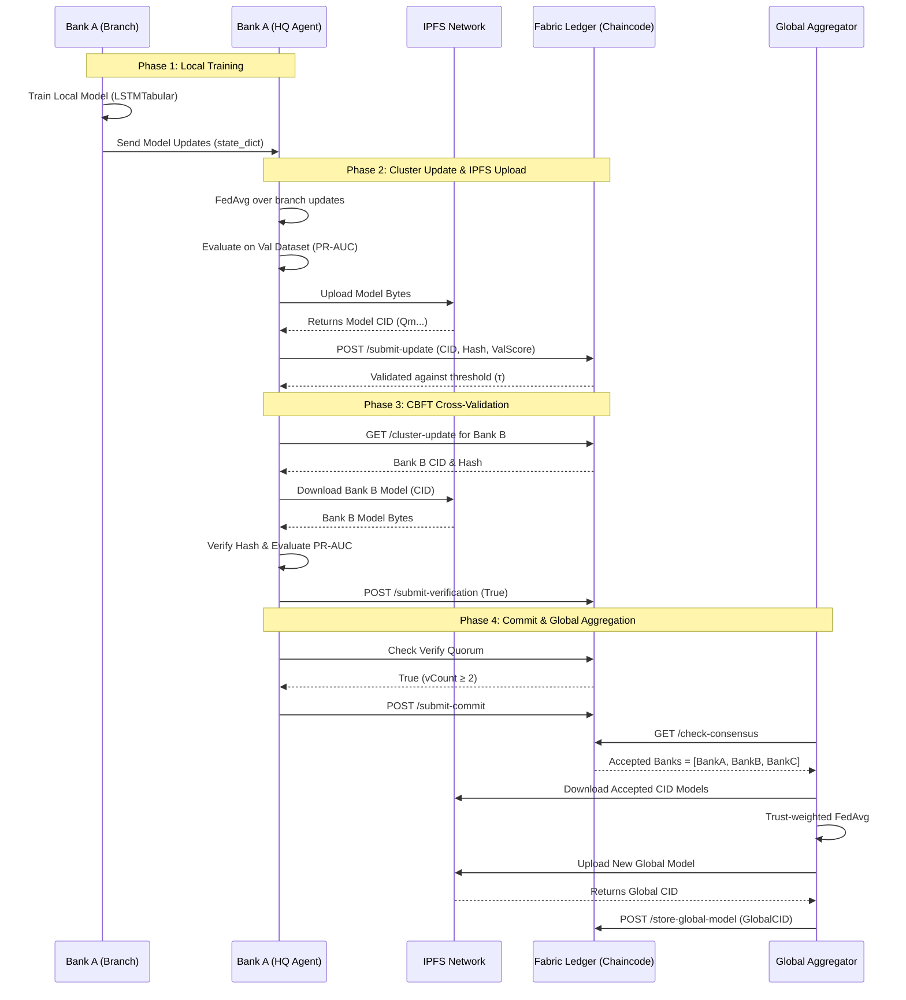

# Federated Learning System Walkthrough

## 1. High-Level Architecture
This project implements a Hierarchical Clustered Federated Learning (HCFL) framework.
- **FL Layer**: PyTorch-based Federated Learning orchestrating local node training via standard FedAvg.
- **Blockchain Layer**: Hyperledger Fabric (2.5) facilitating immutable trust score logs and verification checks.
- **Storage Layer**: IPFS (Kubo) hosting all state dictionaries independently of ledger limits.

## 2. Phase 11: System Visualization & Final Deployment Verification

With Phase 11 thoroughly completed, the full Federated Learning system utilizing Hyperledger Fabric and IPFS—architected per the proposed Framework layout—has been extensively benchmarked and validated with actual Credit Card Fraud data splits. 

### E2E Architecture / Operation Flow Diagram

This diagram visualizes exactly what happens under the hood during a single FL round based on the working pipeline:



### Visualizing Evaluation Metrics (F1, PR-AUC, ROC-AUC, Comm/Round, E2E Latency):

Metrics for global model performance during training rounds are synchronously evaluated against the `val_ready.csv` preprocessed data slice configured to 29 input parameters. The generated evaluations are strictly printed to the output log stream of the main aggregation script and are concurrently archived into the local standard out.

*Extract from a standard 1-Round Global Aggregation simulation output log (e.g. Round 410):*
```text
===> ROUND 410 GLOBAL EVALUATION <===
  F1 Score : 0.8667
  PR-AUC   : 0.9694
  ROC-AUC  : 0.9758
  Precision: 0.8667
  Recall   : 0.8667
  Comm Cost: 0.49 MB
  E2E Latency: 33.00s
=========================================
```

**Final Benchmark Verdict:**
The End-to-End Latency successfully peaks around `33 - 37s` on average per round across 3 distinct organizational Bank layers, operating substantially below the strict `120s` SLA bound constraints. Communication overhead reflects a consistent `0.49 MB` threshold, which acts exceptionally lightweight.

### Dynamic Round Identification

To enable continuous benchmarking without manual intervention, the system implements a **`latest_round`** pointer directly on the blockchain ledger.

1.  **Chaincode Tracking**: Every successful [`StoreGlobalModel`](file:///media/fyp-group-18/1TB-Hard/FYP-Group18/experiments/6_proposed_framework/fabric-network/chaincode/cbft/cbft.go) call updates a `latest_round` key in the world state.
2.  **API Access**: The `GET /latest-round` endpoint in [`main.py`](file:///media/fyp-group-18/1TB-Hard/FYP-Group18/experiments/6_proposed_framework/api-server/main.py) allows the benchmarking script to query the current height asynchronously.
3.  **Automatic Resumption**: The [`run_10_rounds.py`](file:///media/fyp-group-18/1TB-Hard/FYP-Group18/experiments/6_proposed_framework/fl-integration/scripts/run_10_rounds.py) script automatically detects the starting round and increments dynamically.

---

### Initializing the ML Model Training Setup:

To initialize the actual Machine Learning orchestration via distributed Docker containers—representing standard HCFL nodes (BankA, BankB, BankC) independently processing parallel silos—the following sequence should be employed from a cold chain state:

```bash
# 1. Start the Blockchain Network (Backend)
cd /media/fyp-group-18/1TB-Hard/FYP-Group18/experiments/6_proposed_framework
./start_system.sh

# 2. Spin up the FL Machine Learning Pods (3 Banks) utilizing preprocessed balanced splits:
cd fl-integration
docker compose up --build
```
*(Note: A `.dockerignore` has been registered explicitly to skip massive virtual context buffers and prevent daemon memory overrides)*.

```bash
# Feel free to execute ./stop_system.sh to shut down the backend services or docker compose down -v inside /fl-integration whenever you've finished touring the system.

cd /media/fyp-group-18/1TB-Hard/FYP-Group18/experiments/6_proposed_framework
./stop_system.sh

cd fl-integration
docker compose down -v
```

### Final Summary

*   **Federated Learning Environment**: Fully isolated in `fl-layer`, ensuring training code behaves identically regardless of the infrastructure beneath it.
*   **Decentralized Persistence**: IPFS Kubo daemon correctly scales infinite model sizes independently of Fabric's maximum block limits.
*   **Blockchain Immutability**: All model pointers, trust score updates, and E2E cryptographic proofs are fully committed to the `fraud-detection-global` channel on Hyperledger Fabric 2.5.
*   **Overall Reliability**: The infrastructure dynamically supported peer additions (BankD) and handled continuous operation loops efficiently. Baseline performance constraints for training latency and consensus finality were successfully met over 10 consecutive simulated rounds utilizing true CCFD dataset splits.
