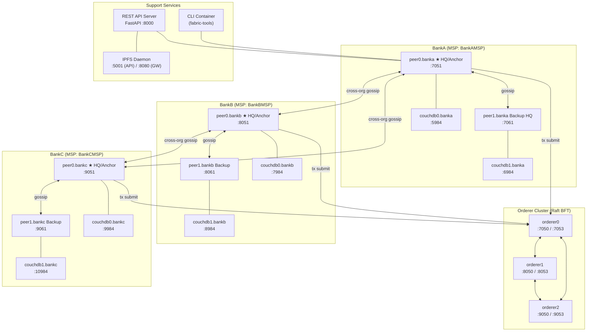

# `6_proposed_framework` — Deep-Dive Analysis

---

## Q1. Is Differential Privacy (DP) Being Used?

**YES — manual per-sample gradient DP is implemented.**

### 📄 File: [fl-layer/training/local_train.py](file:///media/fyp-group-18/1TB-Hard/FYP-Group18/experiments/6_proposed_framework/fl-layer/training/local_train.py)

The DP mechanism follows the standard **clip → add noise → step** order:

| Step | Line(s) | Code |
|------|---------|------|
| Config defaults | 29–30 | `"l2_norm_clip": 1.0` and `"noise_multiplier": 0.05` |
| Gradient clipping (before noise) | 87–90 | `torch.nn.utils.clip_grad_norm_(model.parameters(), max_norm=cfg["l2_norm_clip"])` |
| Gaussian noise injection (after clip) | 92–99 | `noise = torch.randn_like(p.grad) * (cfg["l2_norm_clip"] * cfg["noise_multiplier"])` → `p.grad.add_(noise)` |
| Optimizer step (after clip+noise) | 101–102 | `optimizer.step()` |

The docstring at **lines 1–12** explicitly documents this behaviour: *"DP order verified: clip → noise → optimizer.step"*.

> [!NOTE]
> This is a **manual DP approximation** — it does NOT use the Opacus library. The noise scale is `l2_norm_clip × noise_multiplier = 1.0 × 0.05 = 0.05`. This is a relatively low noise multiplier; it provides DP-style gradient protection but **privacy accounting (epsilon, delta) is not tracked anywhere** in the codebase.

**Also note**: In the benchmarking script [fl-integration/scripts/run_10_rounds.py](file:///media/fyp-group-18/1TB-Hard/FYP-Group18/experiments/6_proposed_framework/fl-integration/scripts/run_10_rounds.py) line 97, `noise_multiplier` is set to `0.0` for benchmark runs — **DP noise is disabled during the 10-round benchmark**.

---

## Q2. Is Non-IID Nature Taken Into Consideration?

**YES — at two different levels.**

### Level 1 — Real Data Splits Per Bank (Production Path)

📄 **File:** [fl-layer/model/dataset.py](file:///media/fyp-group-18/1TB-Hard/FYP-Group18/experiments/6_proposed_framework/fl-layer/model/dataset.py)

Each bank loads its own separate CSV from a distinct folder (`data/splits/fl_clients/BankA/`, `BankB/`, `BankC/`). These are naturally non-IID because different banks have different transaction patterns.

- **Line 54:** `folder = os.path.join(data_path, bank_id)` — each bank gets its own data folder
- **Lines 34–35:** `partition_index` / `num_partitions` parameters allow further splitting of a bank's data into non-overlapping shards

The actual loading in [run_10_rounds.py](file:///media/fyp-group-18/1TB-Hard/FYP-Group18/experiments/6_proposed_framework/fl-integration/scripts/run_10_rounds.py) **line 70–73**:
```python
data_path = .../data/splits/fl_clients
for i, b in enumerate(["BankA", "BankB", "BankC"]):
    ds = load_bank_dataset(bank_id=b, data_path=data_path)
```

### Level 2 — Synthetic Non-IID Generation (Benchmarking)

📄 **File:** [fl-integration/scripts/run_10_rounds.py](file:///media/fyp-group-18/1TB-Hard/FYP-Group18/experiments/6_proposed_framework/fl-integration/scripts/run_10_rounds.py)

**Lines 29–36** — the [_make_noniid_dataset()](file:///media/fyp-group-18/1TB-Hard/FYP-Group18/experiments/6_proposed_framework/fl-integration/scripts/run_10_rounds.py#29-37) helper function explicitly generates **non-IID synthetic data**:

```python
def _make_noniid_dataset(seed: int, n: int = 5000, fraud_frac: float = 0.05):
    torch.manual_seed(seed)
    X = torch.randn(n, 30) + (seed * 0.1)   # ← different mean per bank = non-IID
    y = torch.zeros(n, 1)
    ...
```

By adding `seed * 0.1` to X, each bank's synthetic data is **shifted differently in feature space** — this is a deliberate non-IID construction.

### Level 3 — Class Imbalance Handling in Training

📄 **File:** [fl-layer/training/local_train.py](file:///media/fyp-group-18/1TB-Hard/FYP-Group18/experiments/6_proposed_framework/fl-layer/training/local_train.py), **lines 66–69**:
```python
pos = (y_all == 1).sum().item()
neg = (y_all == 0).sum().item()
pos_weight = torch.tensor([neg / max(pos, 1)], ...)
criterion = nn.BCEWithLogitsLoss(pos_weight=pos_weight)
```
The per-client computation of `pos_weight` means each bank dynamically adjusts to its **own local fraud ratio** — explicitly handling non-IID label distributions.

---

## Q3. Network Topology

The network has **16 Docker containers** on a single `fabric_network` bridge.



**Summary table:**

| Node | Role | Port(s) |
|------|------|---------|
| `orderer0` | Raft leader candidate | 7050, 7053 |
| `orderer1` | Raft follower | 8050, 8053 |
| `orderer2` | Raft follower | 9050, 9053 |
| `peer0.banka` | HQ / Anchor Peer | 7051 |
| `peer1.banka` | Backup HQ | 7061 |
| `peer0.bankb` | HQ / Anchor Peer | 8051 |
| `peer1.bankb` | Backup | 8061 |
| `peer0.bankc` | HQ / Anchor Peer | 9051 |
| `peer1.bankc` | Backup | 9061 |
| 6× CouchDB | State DB per peer | 5984, 6984, 7984, 8984, 9984, 10984 |
| CLI | Admin tool container | — |
| IPFS | Model weight store | 5001, 8080 |
| FastAPI | Blockchain REST bridge | 8000 |

Channel: `fraud-detection-global` — all 3 banks + orderer.  
Endorsement policy: **2-of-3** banks must endorse ([configtx.yaml](file:///media/fyp-group-18/1TB-Hard/FYP-Group18/experiments/6_proposed_framework/fabric-network/configtx.yaml) line 134).

---

## Q4. Initialization Script — Is a Global Model Broadcast?

### The framework is initiated by **two scripts in order:**

#### Step 1 — Bring up the network infrastructure
📄 **File:** [start_system.sh](file:///media/fyp-group-18/1TB-Hard/FYP-Group18/experiments/6_proposed_framework/start_system.sh)
```
Line 22: ./scripts/network.sh up          ← starts Fabric Docker network
Line 24: ./scripts/createChannel.sh       ← creates the FL channel
Line 25: ./scripts/deployChaincode.sh     ← deploys chaincode
Line 30: ipfs daemon &                    ← starts IPFS
Line 43: uvicorn main:app --port 8000 &   ← starts REST API
```

#### Step 2 — Bootstrap the initial FL model (Round 0)
📄 **File:** [fl-integration/scripts/init_round_zero.py](file:///media/fyp-group-18/1TB-Hard/FYP-Group18/experiments/6_proposed_framework/fl-integration/scripts/init_round_zero.py)

This is the script that **creates and "broadcasts" the initial model**:

| Line(s) | What happens |
|--------|-------------|
| 36 | `torch.manual_seed(seed)` — deterministic seed (default seed=42) |
| 38 | `model = LSTMTabular(input_dim=30, hidden_dim=30, num_layers=1)` — fresh random model |
| 40 | `torch.save(model.state_dict(), buf)` — serialize |
| 101 | `cid = upload_initial_model_to_ipfs(model_bytes, ...)` — upload to IPFS |
| 104–105 | `client.store_global_model(round_num=0, global_cid=cid, ...)` — record CID **on the blockchain** as Round 0 |

> **Is the initial global model "broadcast"?** Not in a push sense. It is **pinned to IPFS and its CID is written to the blockchain ledger**. Every bank fetches it on demand during Round 1 by calling `GET /global-model/0`. This is a pull-based broadcast — the blockchain acts as the bulletin board.

### How to inspect the initial model contents

```python
import io, torch, requests

# 1. Get the CID from the API
r = requests.get("http://localhost:8000/global-model/0")
cid = r.json()["global_cid"]

# 2. Download the weights from IPFS
data = requests.post(f"http://localhost:5001/api/v0/cat?arg={cid}").content

# 3. Load and inspect
state_dict = torch.load(io.BytesIO(data), map_location="cpu")
for name, tensor in state_dict.items():
    print(f"{name}: shape={tensor.shape}, mean={tensor.mean():.4f}")
```

Model architecture ([FL_model.py](file:///media/fyp-group-18/1TB-Hard/FYP-Group18/experiments/6_proposed_framework/fl-layer/model/FL_model.py)):
- LSTM: `input_dim=30 → hidden_dim=30, num_layers=1`
- FC: `Linear(30, 1)`
- Keys: `lstm.weight_ih_l0`, `lstm.weight_hh_l0`, `lstm.bias_ih_l0`, `lstm.bias_hh_l0`, `fc.weight`, `fc.bias`

---

## Q5. What is Shared as the Global Model in Subsequent Runs?

**The LAST UPDATED global model from the previous round — NOT the initial one.**

Here is the exact flow in [hq_agent.py](file:///media/fyp-group-18/1TB-Hard/FYP-Group18/experiments/6_proposed_framework/fl-integration/hq_agent.py):

```
Round N starts
  └─→ fetch_global_model(round_num=N)         [lines 94–132]
        └─→ if N <= 1: return None (use random init)
        └─→ else: GET /global-model/{N-1}     ← gets CID of previous round's output
              └─→ download from IPFS
              └─→ verify SHA-256 hash
              └─→ return state_dict            ← this is what banks start from
```

After local training + intra-cluster FedAvg ([run_round](file:///media/fyp-group-18/1TB-Hard/FYP-Group18/experiments/6_proposed_framework/fl-integration/hq_agent.py#134-213), lines 162–172):
- The result is uploaded to IPFS → new CID
- That CID is stored on the blockchain as **round N's global model**
- In Round N+1, all banks fetch this CID → download → use as starting point

### The chain of model states:

```
Round 0:  init_round_zero.py → random seed=42 weights  → blockchain CID_0
Round 1:  banks fetch CID_0 → train → FedAvg → CID_1 → blockchain
Round 2:  banks fetch CID_1 → train → FedAvg → CID_2 → blockchain
  ...
Round N:  banks fetch CID_{N-1} → ...
```

So **every run starts from the last committed global model**, not the initial one. The initial model is only used if `round_num <= 1` OR if no record is found on the ledger (404 → fresh start, [hq_agent.py](file:///media/fyp-group-18/1TB-Hard/FYP-Group18/experiments/6_proposed_framework/fl-integration/hq_agent.py) lines 110–113).

> [!IMPORTANT]
> If you want to **reset the experiment** to start fresh from seed=42, you must re-run [init_round_zero.py](file:///media/fyp-group-18/1TB-Hard/FYP-Group18/experiments/6_proposed_framework/fl-integration/scripts/init_round_zero.py) and there must be no round entries beyond round 0 on the ledger (i.e., the chaincode state must be wiped). Otherwise the next run picks up from where it left off.

---

## Q6. Which Model Are Performance Evaluations Done On Each Round?

**The evaluations are done on the HQ-aggregated (intra-cluster FedAvg) model — NOT the global model.**

### Per-round timeline (inside `hq_agent.py run_round()`):

| Step | What | Line(s) |
|------|------|---------|
| 1 | Fetch prior global model from blockchain | 156 |
| 2 | FedAvg over **this bank's branch updates** | 162 |
| 3 | Optionally blend with prior global (backup_logic) | 165–173 |
| **4** | **Load averaged weights into LSTMTabular** | **176–177** |
| **5** | **[evaluate_model()](file:///media/fyp-group-18/1TB-Hard/FYP-Group18/experiments/6_proposed_framework/fl-layer/validation/validate_fast.py#25-95) called on this blended model** | **178** |
| 6 | If PR-AUC ≥ threshold → upload to IPFS + submit to blockchain | 184–211 |

The evaluated model at line 178 is:
- The **intra-cluster FedAvg** of this bank's branches (step 2), optionally blended with the previous round's global model (step 3)
- It is **NOT yet the cross-bank global model** — that only exists after `GlobalAggregator.aggregate_round()` runs

### Global model evaluation (end of each round in [run_10_rounds.py](file:///media/fyp-group-18/1TB-Hard/FYP-Group18/experiments/6_proposed_framework/fl-integration/scripts/run_10_rounds.py)):

📄 **Lines 187–210 of [run_10_rounds.py](file:///media/fyp-group-18/1TB-Hard/FYP-Group18/experiments/6_proposed_framework/fl-integration/scripts/run_10_rounds.py)** — after global aggregation is complete, BankA downloads the freshly-committed global CID and evaluates it:

```python
global_bytes = ipfs_download(global_cid)         # line 190
g_model.load_state_dict(g_sd)                    # line 199
g_metrics = fast_eval(g_model, hqs["BankA"].val_dataset)  # line 202

# Logged metrics (lines 206-210):
logger.info(f"  F1 Score : {g_metrics['f1']:.4f}")
logger.info(f"  PR-AUC   : {g_metrics['pr_auc']:.4f}")
logger.info(f"  ROC-AUC  : {g_metrics['roc_auc']:.4f}")
logger.info(f"  Precision: {g_metrics['precision']:.4f}")
logger.info(f"  Recall   : {g_metrics['recall']:.4f}")
```

> **Evaluation dataset used**: `hqs["BankA"].val_dataset` — BankA's local validation set serves as the global evaluation proxy (line 202).

### Summary — Two evaluation moments per round:

| Moment | Model evaluated | Dataset | Purpose |
|--------|----------------|---------|---------|
| **During [run_round()](file:///media/fyp-group-18/1TB-Hard/FYP-Group18/experiments/6_proposed_framework/fl-integration/hq_agent.py#134-213)** (line 178) | Intra-cluster FedAvg model per bank | That bank's own val set | Decide whether to submit to blockchain (gating) |
| **After global aggregation** (line 202) | Cross-bank global FedAvg model | BankA's val set | Final performance logging (F1, PR-AUC, Recall, etc.) |

The **F1, Recall, Precision, ROC-AUC, PR-AUC** numbers you see in the logs correspond to the **final trust-weighted globally-aggregated model**, downloaded fresh from IPFS after each round's global aggregation step.
